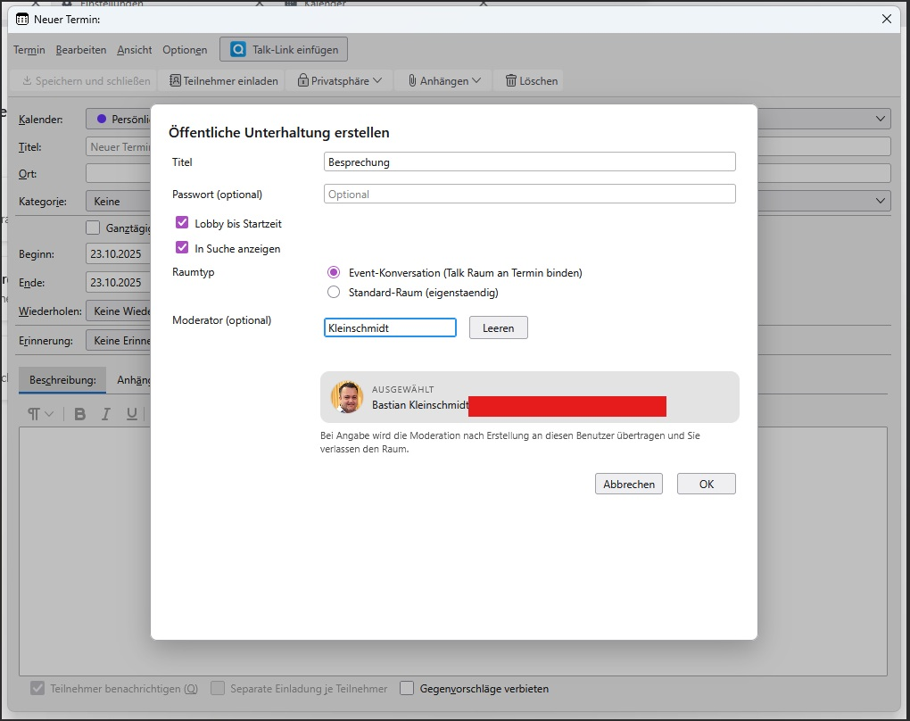

# Nextcloud Talk Direkt - Entwicklerleitfaden

<p align="center">
  
</p>

Diese Variante des Nextcloud-Talk-Add-ons erweitert den Thunderbird-Termin-Dialog
um einen Direkt-Button, der ohne Umwege eine neue oeffentliche Unterhaltung anlegt
und den Link automatisch in das Ereignis eintraegt.

## Verzeichnisstruktur

Nextcloud Talk 2.0.1/
|- background.js          # Hintergrundlogik: REST-Calls, Adressbuch, Utilities
|- experiments/
|  |- calToolbar/
|  |  |- parent.js        # Frontend/Experiment, Dialog & Button
|  |  |- schema.json      # Experiment-API-Beschreibung
|- icons/                 # Add-on-Icons (verschiedene Groessen)
|- manifest.json          # Manifest v2 + browser_specific_settings
|- options.html/.js       # Einstellungsdialog fuer URL/Benutzer/App-Passwort
|- README.md              # Diese Datei

## Wichtige Ablaeufe

1. **Toolbar-Injektion** (`parent.js::inject`): fuegt den Button in Termin- und Aufgaben-Dialoge
   ein. Alle Event-Listener werden zentral ueber `handle(...)` registriert.
2. **Erstellen-Dialog** (`openCreateDialog`): steuert die UI fuer Titel, Passwort, Lobby-Optionen
   sowie Moderator-Auswahl und delegiert alle Netzwerk-Operationen an das Hintergrundskript.
3. **Hintergrundskript** (`background.js`):
   - Talk-REST-Aufrufe (`/ocs/v2.php/apps/spreed/...`)
   - CardDAV-Lookups (`remote.php/dav/...`) des Nextcloud-Systemadressbuchs
   - Avatar-Verarbeitung (Pixel-Extraktion + Serialisierung fuer das Frontend)
4. **Lobby-Watcher** (`setupLobbyWatcher`): beobachtet Termin-Aenderungen und synchronisiert die
   Lobby-Startzeit nach dem Speichern. Berechtigungsfehler werden abgefangen und sichtbar gemacht.

## Berechtigungen

- `storage`: persistiert Basis-URL, Benutzername und App-Passwort.
- Host-Permissions `*://*/ocs/*` und `*://*/remote.php/*`: notwendig fuer Talk- und CardDAV-Aufrufe.
  Weitere Domains werden nicht angesprochen.
- Keine Content-Skripte; alle Requests laufen ueber `fetch` im Hintergrundskript.

## Sicherheit & Robustheit

- Jeder Netzwerk-Request wird in `try/catch` gefasst und mit aussagekraeftigen Fehlermeldungen
  quittiert. 403-Antworten koennen z.B. die Lobby-Option deaktivieren.
- Systemadressbuch-Ergebnisse werden fuer 5 Minuten gecacht (`SYSTEM_ADDRESSBOOK_TTL`). Danach
  wird neu beim Server angefragt.
- Avatar-Daten werden nur als Plain-Array weitergereicht (kein ArrayBuffer erforderlich), womit
  Structured-Clone-Probleme in Thunderbird vermieden werden.

## Aenderungen in Version 2.0.1

- **Event-Konversationen**: Optionaler Modus koppelt den Talk-Raum an den Termin (`objectType:event`,
  `objectId`). Bei fehlender Server-Unterstuetzung faellt das Add-on automatisch auf den bisherigen
  Standard-Raum zurueck.
- **Avatar-Pipeline**: Hintergrund liefert Pixelarrays ohne TypedArray-Abhaengigkeiten; Frontend
  zeichnet Avatare robust inklusive Fallback auf Initialen.
- **Moderator-Vorschau**: Ausgewaehlter Moderator erscheint unterhalb des Eingabefelds mit Avatar
  (oder Initialen) und Name/E-Mail.
- **Dialog-Refit & Debug-Schalter**: Aufgeraeumte UI, erweiterte Statusmeldungen sowie
  zuschaltbares Debug-Logging in den Add-on-Optionen.
- **Debug-Initialisierung**: Experiment referenziert browser.storage erst nach API-Kontext; verhindert
  Startfehler "browser is not defined" im Experiment.
- **Lobby-Setup**: Lobby-Endpoint nutzt wieder `PUT` (Nextcloud Webinar API); Standard-Raeume mit Lobby erzeugen keinen 405-Fallback mehr.
- **Beschreibung**: Event-Konversationen blockieren `PUT /description` (HTTP 400); Update erfolgt nur fuer Standard-Raeume.
- **Capabilities**: Fallback auf `/ocs/v2.php/cloud/capabilities` inklusive Versionspruefung (<32 -> Event-Modus deaktiviert).  Debug-Logs zeigen, welche Quelle (Talk/Cloud) den Support liefert.
- **Mehrsprachige UI**: Dialoge und Optionen in Deutsch/Englisch/Franzoesisch via browser.i18n.
- **Erweitertes Debug-Logging**: Hintergrund (`[NCBG]`) protokolliert alle Kernaktionen inklusive gekuerzter Token/IDs; das Experiment-Frontend (`[NCExp]`) loggt Dialog-Workflows, Listenabrufe und Pending-Delegationen.
- **Verbindungs-Test in den Optionen**: Button "Verbindung testen" prueft Basis-URL, Benutzername und App-Passwort direkt per `/ocs/v2.php/cloud/capabilities` und meldet Erfolg bzw. Fehler mit klarer Statusanzeige.

## Tests & Validierung

- Entwicklung derzeit gegen Thunderbird 140.* bis 144.* (siehe Manifest).
- XPI-Build (PowerShell):
  ```powershell
  # im Verzeichnis "Nextcloud Talk 2.0.1/"
  powershell -File ..\build-xpi.ps1 -SourceDir "." -Destination "..\nctalk-direct-2.0.1.xpi"
  ```
- Installation zum Testen ueber `about:debugging#/runtime/this-thunderbird`.
- Nach jedem Build Konsolenmeldungen pruefen (Filter `[NCBG]`, `[NCExp]` fuer REST/Lobby/Delegation).


