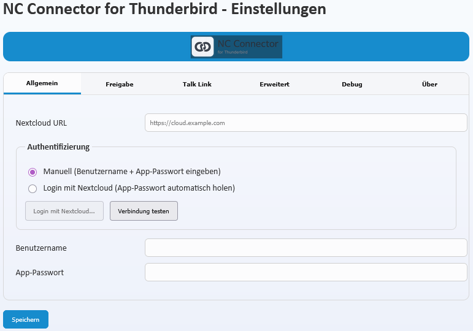
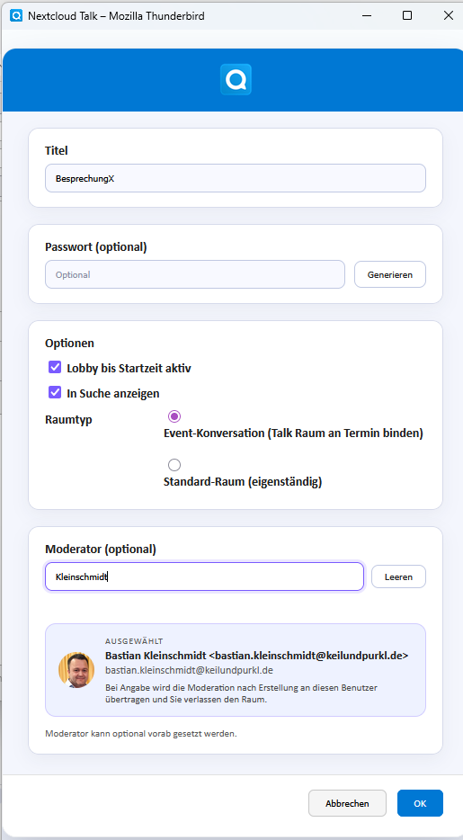
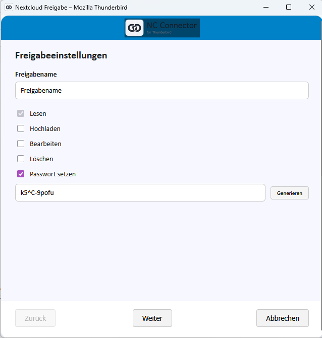
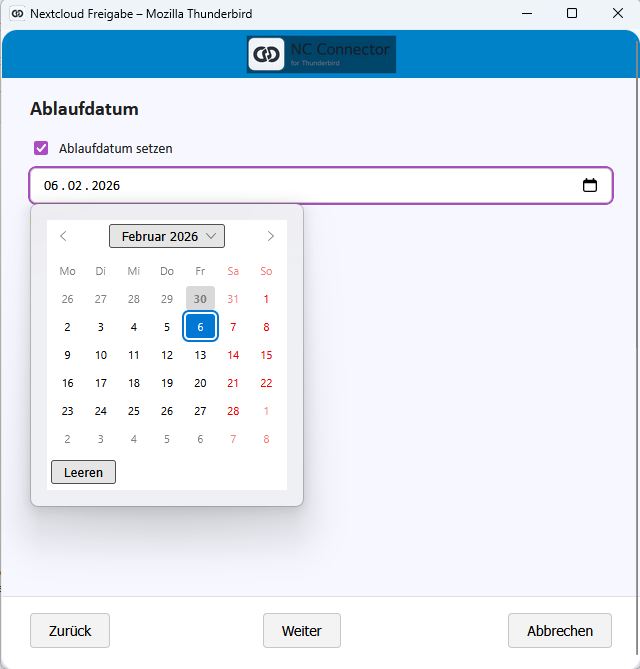
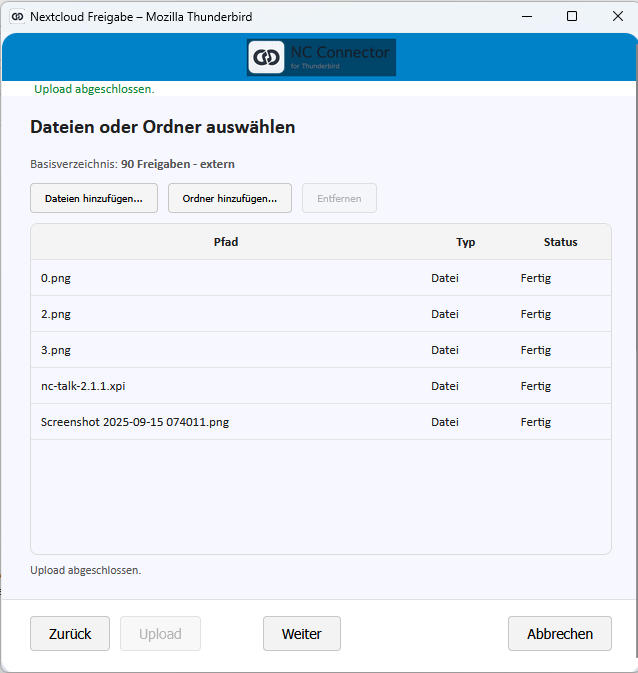
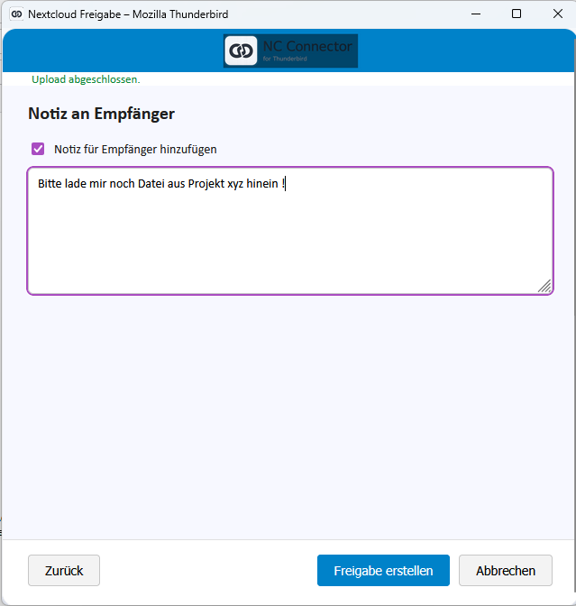
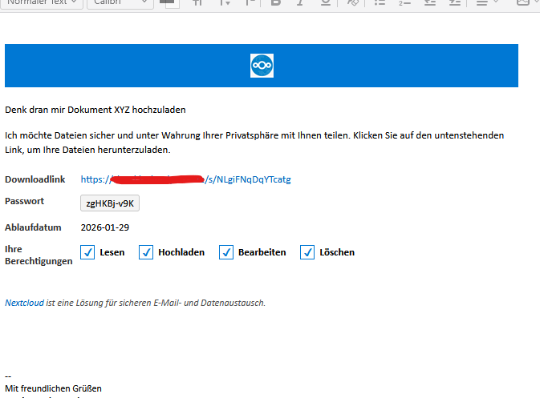

# Nextcloud Enterprise for Thunderbird 

Nextcloud Enterprise for Thunderbird verbindet Ihr Thunderbird direkt mit Nextcloud Talk und der sicheren Nextcloud-Freigabe. Ein einziger Klick öffnet einen modernen Wizard, erstellt automatisch Talk-Räume inklusive Lobby und Moderatoren Delegation und fügt den Meeting-Link mitsamt Passwort sauber in den Termin ein. Aus dem Verfassen-Fenster heraus erzeugen Sie auf Wunsch sofort eine Nextcloud-Freigabe inklusive Upload-Ordner, Ablaufdatum, Passwort und personalisierter Nachricht. Keine Copy-&-Paste-Orgien mehr, keine offenen Links in Mails: alles läuft in Thunderbird, alles wird sauber in Ihrer Nextcloud abgelegt.

## Highlights

- **Ein Klick zu Nextcloud Talk** 
Termin öffnen, Nextcloud Talk wählen, Raum konfigurieren, Moderator definieren. Der Wizard schreibt Titel/Ort/Beschreibung inklusive Hilfe-Link automatisch in den Termin.
- **Filelink deluxe** 
Compose-Button Nextcloud Freigabe hinzufügen startet den Filelink-Assistenten mit Upload-Queue, Passwortgenerator, Ablaufdatum und Notizfeld. Die fertige Freigabe landet als formatiertes HTML direkt in der E-Mail.
- **Enterprise-Sicherheit** 
Lobby bis Startzeit, Moderator-Delegation, automatisches Aufräumen nicht gespeicherter Termine, Pflicht-Passwörter und Ablauffristen schützen sensible Meetings und Dateien.
- **Nahtlose Nextcloud-Integration** 
Login-Flow V2, automatische Raumverfolgung sowie Debug-Logs in [NCBG], [NCUI], [NCFL] helfen beim Troubleshooting.
- **ESR-ready** 
Optimiert und getestet für Thunderbird ESR 140.X mit minimalem Experiment-Anteil.

## Was ist neu in 2.2.1?

- Neues Branding Nextcloud Enterprise for Thunderbird.
- Filelink Wizzard
- Neue Default-Optionen fuer Filelink und Talk (Share-Name, Rechte, Passwort/Ablauf-Tage, Talk-Titel/Lobby/Listbarkeit/Raumtyp).

## Funktionsüberblick

### Nextcloud Talk direkt aus dem Termin
- Talk-Popup mit Lobby, Passwort, Listbarkeit, Raumtyp und Moderatorensuche.
- Automatische Einträge von Titel, Ort, Beschreibung (inkl. Hilfe-Link und Passwort) in das Terminfenster.
- Room-Tracking, Lobby-Updates, Delegations-Workflow und Cleanup, falls der Termin verworfen oder verschoben wird.

### Nextcloud Filelink im Compose-Fenster
- Vier Schritte (Freigabe, Ablaufdatum, Dateien, Notiz) mit passwortgeschütztem Upload-Ordner.
- Upload-Queue mit Duplikatprüfung, Fortschrittsanzeige und optionaler Freigabe.
- Automatische HTML-Bausteine mit Link, Passwort, Ablaufdatum und optionaler Notiz.

### Administration & Compliance
- Login Flow V2 (App-Passwort wird automatisch angelegt) und zentrale Optionen (Basis-URL, Debug-Modus, Filelink-Pfade, Defaultwerte fuer Filelink/Talk).
- Vollständige Internationalisierung (DE/EN/FR) und strukturierte Debug-Logs für Support-Fälle.

## Systemvoraussetzungen
- Thunderbird ESR 140.X (Windows/macOS/Linux)
- Nextcloud mit Talk & Filelink (DAV) aktiviert
- App-Passwort oder Login Flow V2

## Installation
1. Aktuelle XPI 
extcloud-enterprise-2.2.1.xpi in Thunderbird installieren (Add-ons ? Zahnrad ? Add-on aus Datei installieren).
2. Thunderbird neu starten.
3. In den Add-on-Optionen Basis-URL, Benutzer und App-Passwort hinterlegen oder den Login Flow starten.

## Support & Feedback
- **Fehleranalyse:** Debug-Modus in den Optionen aktivieren; relevante Logs erscheinen als [NCUI][Talk], [NCUI][Filelink], [NCBG], [NCFL], [NCExp].

Viel Erfolg beim sicheren, professionellen Arbeiten mit Nextcloud Enterprise for Thunderbird!

## Screenshots

### Settings-Menü

### Talk Wizard

### Filelink Wizard

